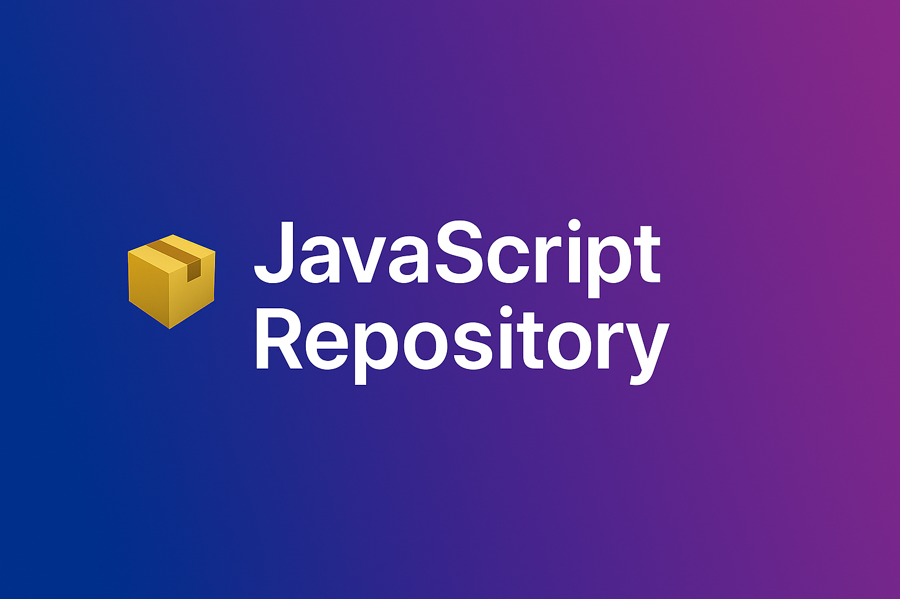

<h1 align="center">📦 JavaScript Repository</h1>

<p align="center">
  A modern collection of JavaScript code snippets, projects, and concepts — from fundamentals to advanced patterns.
</p>

<p align="center">
  
  
  
  
</p>

---
## 🎨 Banner

<p align="center">
  
</p>


---

## 🚀 Introduction

This is a modern JavaScript learning hub, designed for:

- 🚀 Beginners exploring the language
- 🔧 Developers brushing up concepts
- 🛡️ Builders creating mini-projects

Learn through **clear examples**, **mini apps**, and **best practices** using **ES6+ and beyond**.

---

## 📚 Key Concepts Covered

- 🧬 Variables, Data Types, and Operators  
- 🔁 Loops and Control Flow  
- 📦 Functions & Closures  
- 🧱 OOP (Objects, Classes, Inheritance)  
- 🧠 Recursion & Memoization  
- ⏳ Promises, Async/Await  
- 🌐 DOM Manipulation  
- 👡 Event Handling  
- 🤮 Error Handling & Try/Catch  
- 💡 ES6+ Features (Arrow functions, Spread, Destructuring, Modules)

---

## 🛠️ Setup & Scripts

You can use this repo with Node or in-browser.

Install dependencies:
```bash
npm install
```

Run tests or lint:
```bash
npm run test
npm run lint
```

---

## 📄 Sample package.json

```json
{
  "name": "javascript-repo",
  "version": "1.0.0",
  "type": "module",
  "scripts": {
    "lint": "eslint .",
    "test": "jest"
  },
  "devDependencies": {
    "eslint": "^8.56.0",
    "jest": "^29.6.1"
  }
}
```

---

## 📊 Pseudo Code Example

```
1. Loop through array.
2. For each index, find the smallest element from unsorted section.
3. Swap it with current index.
4. Repeat until sorted.
```

---

## 📸 Screenshots

Add screenshots of your mini projects inside `./projects` here.

---

## 📘️ Documentation (JSDoc)

Use JSDoc to document functions:

```js
/**
 * Adds two numbers.
 * @param {number} a 
 * @param {number} b 
 * @returns {number}
 */
function add(a, b) {
  return a + b;
}
```

Build docs using JSDoc:
```bash
npx jsdoc -c jsdoc.json
```

---

## ⚙️ GitHub Actions (CI/CD)

```yaml
# .github/workflows/lint.yml
name: Lint

on: [push, pull_request]

jobs:
  lint:
    runs-on: ubuntu-latest
    steps:
      - uses: actions/checkout@v3
      - name: Setup Node.js
        uses: actions/setup-node@v3
        with:
          node-version: '18'
      - run: npm install
      - run: npm run lint
```

---

## 🤝 Contribution Guide

See `CONTRIBUTING.md` for full guidelines.

Quick steps:

```bash
1. Fork this repo
2. Create a new branch
3. Commit your changes
4. Push and open a Pull Request
```

---

## 📬 Contact

- GitHub: [@PREM015](https://github.com/PREM015)
- Email: [dev@youremail.com](mailto:dev@youremail.com)

---

## 📄 License

This project is licensed under the **MIT License** — see `LICENSE` for details.

---

<h3 align="center">🧠 Learn. Build. Share. Repeat. 💪</h3> 
<h4 align="center">✨ Master JavaScript the modern way!</h4>